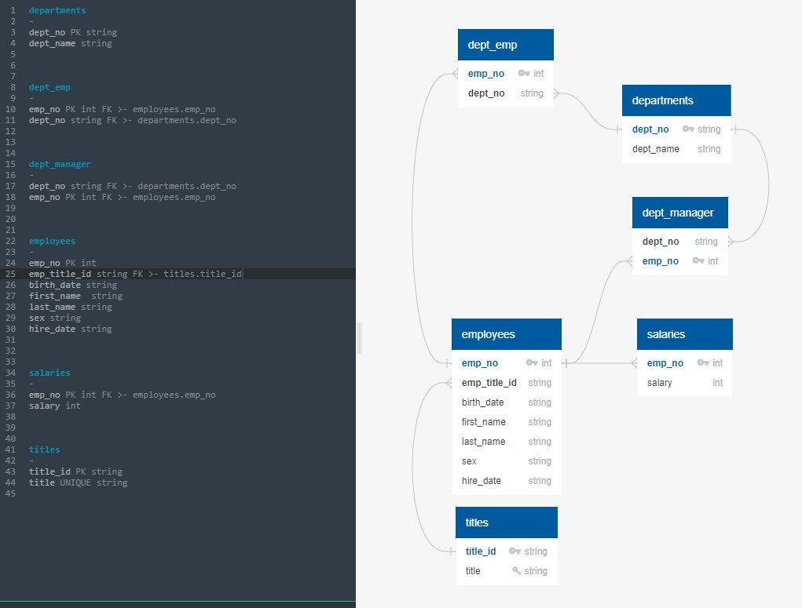
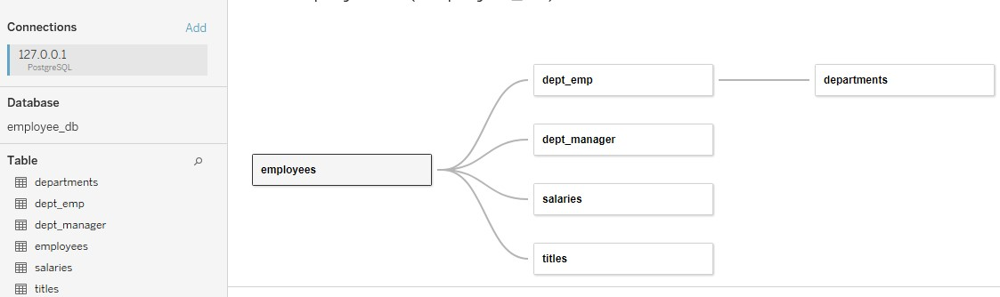

# SQL CHALLENGE

## About:
* Create a data model and build corresponding database to analyze CSV files. 
* See Requirements.md for requirements

### Thought process
* Queries used supplied in .sql files
* Schema documentation includes an image, text for deriving a sketch of the schema, and create table script 
* Jupyter notebook supplied to show thought process leading to data model. 

### Constructed data model

## Bonus: Tableau workbook. 
 * Developed equivalent worksheets in Tableau 2021.2; added bonus queries.
 * Data model in Tableau is as illustrated:
 

## Bonus: Tableau workbook. 
 * Developed equivalent worksheets in Tableau 2021.2; added bonus queries. 
 * See Requirements.md for requirements
 * Easter egg - employee # 499942
